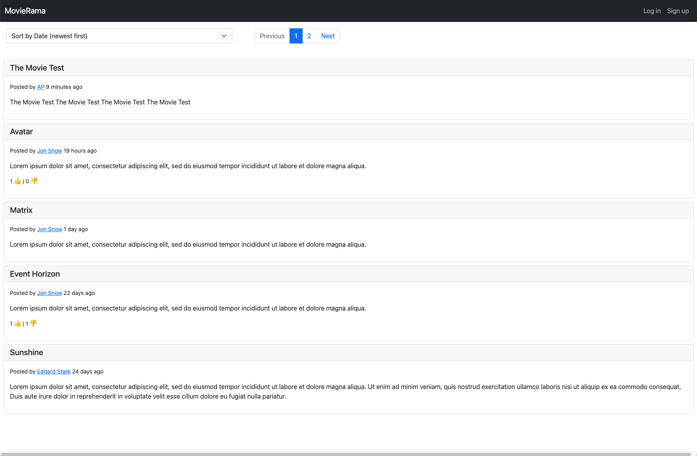
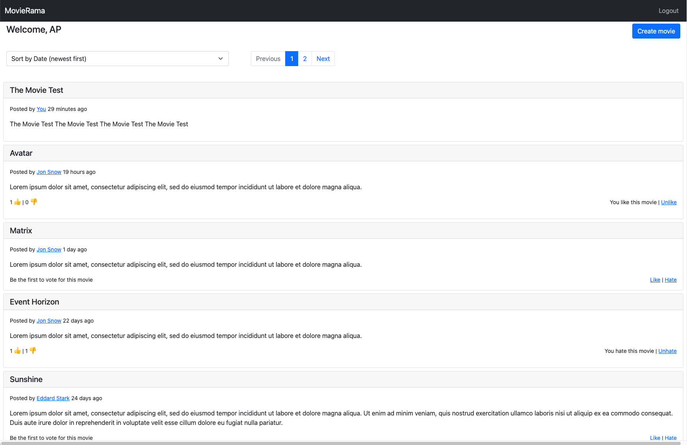

# movierama

A Spring Boot app that implements a simple social sharing platform where users can share their favorite movies.

This project is built on top of the Spring Boot framework and uses a relational database to store information about the users, 
the movies and the votes for each movie. Thymeleaf template engine is used to serve a basic user interface.

Once you run the application as described in the next steps, you can access the ui by:
http://localhost:8089/movies

Once registered and logged-in, you can create a movie and vote for others.

## Build the application

Requirements: 
* Java 17
* Maven 3.8

`mvn clean package -DskipTests`

## Run the application

You can run the application using your IDE or by executing:

`mvn spring-boot:run`

On application start up, the H2 database will be created as file under the user's directory.
You can change the location of the file as well as the database credentials configured in `src/main/resources/application.properties`.  
Liquibase has been used for initial DB schema creation as well as for some initial data entry.

`spring.datasource.url=jdbc:h2:~/movierama-db`  
`spring.datasource.username=sa`  
`spring.datasource.password=sa`

You can view the database while the application is running,  by accessing:
http://localhost:8089/h2-console

